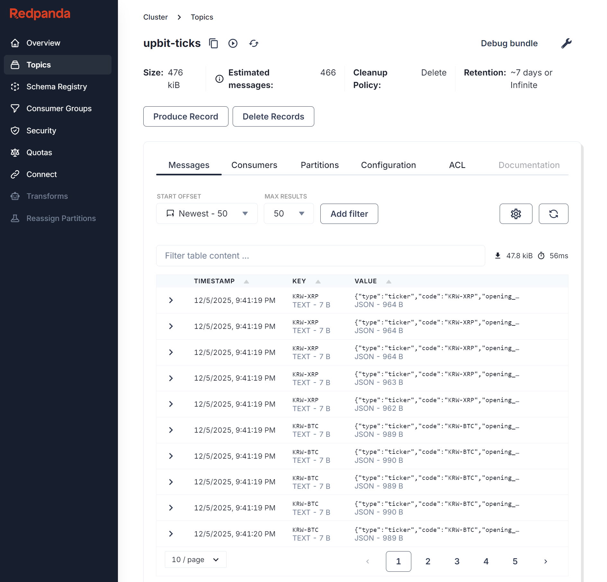
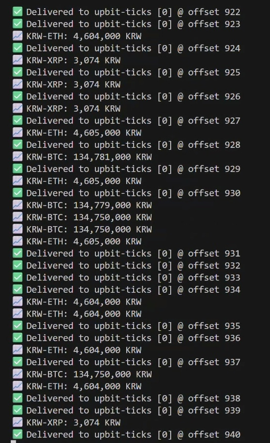
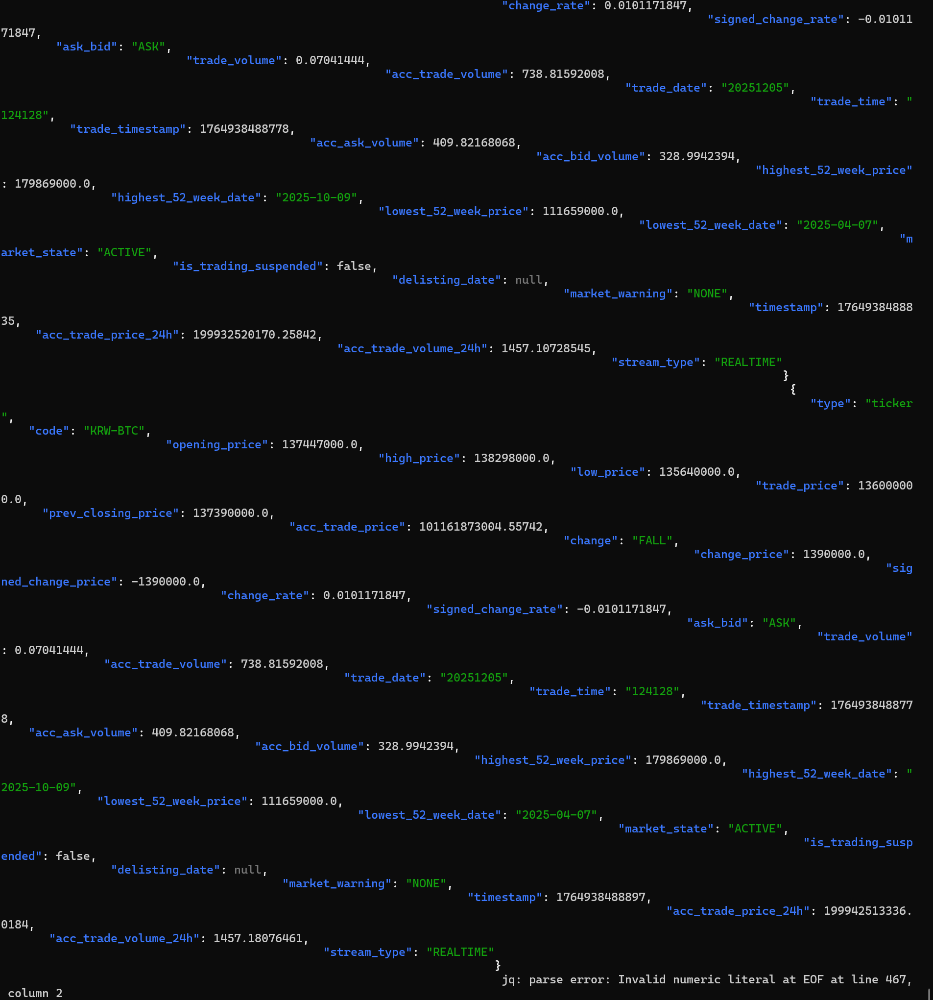

# Upbit Streaming with Redpanda


A lightweight real-time streaming pipeline that captures crypto price ticks from Upbit and streams them into Redpanda.

- **Upbit WebSocket API**
- **Python async producer & consumer**
- **Redpanda** (Kafka-compatible streaming platform)
- **Docker** for local Redpanda setup

---

## 📂 Project Structure

```text
upbit-streaming/
├── docker/
│   └── docker-compose.yml
├── producer/
│   ├── producer.py
│   ├── consumer.py
│   └── requirements.txt
├── assets/
│   ├── console_screenshot.png
│   ├── jq_screenshot.png
│   └── producer_output.jpg
└── README.md
```

---
## 🎥 Demo


**[📹 Watch Full Quality Demo ](https://github.com/yeoreums/upbit-streaming/raw/main/assets/demo.mp4)**

### What you'll see:
- ✅ Real-time BTC, ETH, XRP price streaming
- ✅ Redpanda Console UI
- ✅ Producer delivery confirmations
- ✅ Consumer reading messages with jq

---

## 🚀 How to Run
### 1. Start Redpanda (Docker)
Navigate to the docker directory and spin up the container.


```bash
cd docker
docker-compose up -d
```
- **Kafka (external)**: `localhost:19092`
- **Console UI**: http://localhost:8080

### 2. Install Dependencies
Set up the Python environment and install the required packages.

```Bash
cd ../producer
python3 -m venv venv
source venv/bin/activate  # On Windows use: venv\Scripts\activate
pip install -r requirements.txt
```

### 3. Run the Producer
Start streaming data from the Upbit WebSocket.

```Bash
python producer.py
Streams real-time ticks for: KRW-BTC, KRW-ETH, KRW-XRP
```

### 4. Run the Consumer
Open a new terminal to consume the messages from Redpanda.

```bash
docker exec -it redpanda rpk topic consume upbit-ticks \
  --brokers redpanda:9092 -f '%v\n' | jq
```
---
## 🛠 Tech Stack

| Component | Technology |
|-----------|------------|
| Message Broker | Redpanda (Kafka-compatible) |
| Producer | Python 3.x (asyncio, websockets) |
| WebSocket API | Upbit Exchange |
| Monitoring | Redpanda Console |
| Infrastructure | Docker Compose |
---

## 🏗 Architecture
```
graph LR
  A[Upbit WebSocket] --> B[Python Producer]
  B --> C[Redpanda]
  C --> D[Console UI]
  C --> E[Python Consumer]
```
---

## 🐛 Troubleshooting

**Port already in use?**
```bash
docker-compose down
docker ps -a | grep redpanda  # Check for old containers
docker rm -f redpanda redpanda-console
```

**Producer can't connect?**
- Ensure Redpanda is running: `docker ps`
- Check logs: `docker logs redpanda`
- Verify connectivity: `nc -zv localhost 19092`

**No messages in Console?**
- Check producer is running and showing `✅ Delivered`
- Verify topic exists: `docker exec -it redpanda rpk topic list`
---

### 📸 Screenshots



