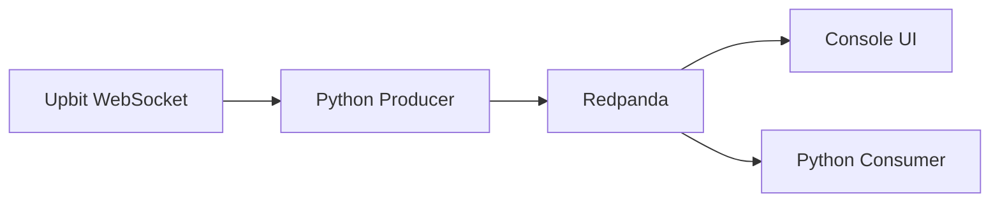

# Upbit Streaming with Redpanda


Real-time streaming pipeline capturing Upbit WebSocket price ticks and delivering them into Redpanda (Kafka-compatible).

## 📑 Table of Contents
- [🛠 Tech Stack](#-tech-stack)
- [📂 Project Structure](#-project-structure)
- [🎥 Demo](#-demo)
- [🚀 Quick Start](#-quick-start)
- [🧪 Running Tests](#-running-tests)
- [🏗 Architecture](#-architecture)
- [📸 Screenshots](#-screenshots)
- [🐛 Troubleshooting](#-troubleshooting)

**Features:**
- 🔥 Real-time WebSocket streaming from Upbit
- 🚀 Kafka-compatible message broker (Redpanda)
- 🐳 Dockerized infrastructure
- 🧪 Unit tested with pytest
- ✅ CI/CD with GitHub Actions

---

## 🛠 Tech Stack

| Component | Technology |
|-----------|------------|
| Message Broker | Redpanda (Kafka-compatible) |
| Producer | Python 3.x (asyncio, websockets, confluent-kafka) |
| WebSocket API | Upbit Exchange |
| Monitoring | Redpanda Console |
| Infrastructure | Docker Compose |
| Testing | pytest |
| CI/CD | GitHub Actions |

---

## 📂 Project Structure
```text
upbit-streaming/
├── .github/
│   └── workflows/
│       ├── test.yml          # Automated testing
│       └── lint.yml          # Code quality checks
├── docker/
│   └── docker-compose.yml    # Redpanda infrastructure
├── producer/
│   ├── producer.py           # WebSocket → Kafka producer
│   ├── requirements.txt      # Python dependencies
│   └── tests/
│       ├── __init__.py
│       └── test_producer.py  # Unit tests
├── assets/
│   ├── demo.gif
│   ├── demo.mp4
│   └── screenshots/
└── README.md
```

---
## 🎥 Demo


**[📹 Watch Full Quality Demo (4MB)](https://github.com/yeoreums/upbit-streaming/raw/main/assets/demo.mp4)**

### What you'll see:
- ✅ Real-time BTC, ETH, XRP price streaming
- ✅ Redpanda Console UI
- ✅ Producer delivery confirmations
- ✅ Consumer reading messages with jq

---

## 🚀 Quick Start

### Prerequisites
- Docker & Docker Compose
- Python 3.8+
- WSL2 (for Windows users)

### 1. Start Redpanda
```bash
cd docker
docker-compose up -d
```

**Services:**
- **Kafka (external)**: `localhost:19092`
- **Console UI**: http://localhost:8080

### 2. Install Dependencies
```Bash
cd ../producer
python3 -m venv venv
source venv/bin/activate  # On Windows use: venv\Scripts\activate
pip install -r requirements.txt
```

### 3. Run the Producer
```bash
python producer.py
```

Streams real-time ticks for: **KRW-BTC, KRW-ETH, KRW-XRP**


### 4. Run the Consumer
**Option A: Web UI**
- Open http://localhost:8080
- Navigate to Topics → `upbit-ticks`

**Option B: CLI**
```bash
docker exec -it redpanda rpk topic consume upbit-ticks \
  --brokers redpanda:9092 -f '%v\n' | jq
```

---

## 🧪 Running Tests
```bash
cd producer
source venv/bin/activate

# Run all tests
pytest tests/ -v

# Run with coverage
pytest tests/ --cov=producer --cov-report=html

# Run linting
flake8 producer.py tests/ --max-line-length=100
```

**CI/CD:** Tests run automatically on every push via GitHub Actions.

---

## 🏗 Architecture




**Data Flow:**
1. Producer connects to Upbit WebSocket API
2. Receives real-time price ticks (JSON)
3. Publishes to Redpanda topic `upbit-ticks`
4. Data available for consumption via Kafka protocol

---

### 📸 Screenshots
### Redpanda Console


### Producer Output


### Message Data (jq)


---

## 🐛 Troubleshooting

For detailed debugging steps → see [Troubleshooting Guide](docs/troubleshooting.md)