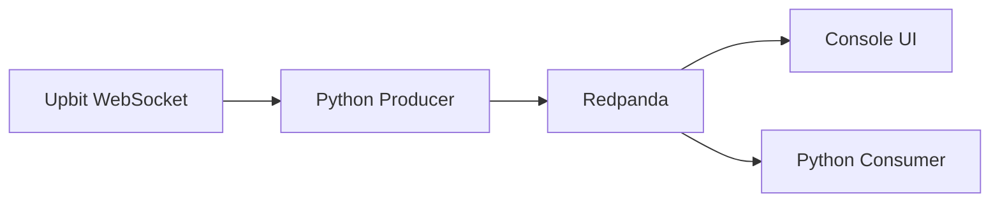

# Upbit Streaming with Redpanda


A lightweight real-time streaming pipeline that captures crypto price ticks from Upbit and streams them into Redpanda.

**Features:**
- 🔥 Real-time WebSocket streaming from Upbit
- 🚀 Kafka-compatible message broker (Redpanda)
- 🐳 Dockerized infrastructure
- 🧪 Unit tested with pytest
- ✅ CI/CD with GitHub Actions

---

## 🛠 Tech Stack

| Component | Technology |
|-----------|------------|
| Message Broker | Redpanda (Kafka-compatible) |
| Producer | Python 3.x (asyncio, websockets, confluent-kafka) |
| WebSocket API | Upbit Exchange |
| Monitoring | Redpanda Console |
| Infrastructure | Docker Compose |
| Testing | pytest |
| CI/CD | GitHub Actions |

---

## 📂 Project Structure
```text
upbit-streaming/
├── .github/
│   └── workflows/
│       └── test.yml          # Automated testing
├── docker/
│   └── docker-compose.yml    # Redpanda infrastructure
├── producer/
│   ├── producer.py           # WebSocket → Kafka producer
│   ├── requirements.txt      # Python dependencies
│   └── tests/
│       ├── __init__.py
│       └── test_producer.py  # Unit tests
├── assets/
│   ├── demo.gif
│   ├── demo.mp4
│   └── screenshots/
└── README.md
```

---
## 🎥 Demo


**[📹 Watch Full Quality Demo (4MB)](https://github.com/yeoreums/upbit-streaming/raw/main/assets/demo.mp4)**

### What you'll see:
- ✅ Real-time BTC, ETH, XRP price streaming
- ✅ Redpanda Console UI
- ✅ Producer delivery confirmations
- ✅ Consumer reading messages with jq

---

## 🚀 Quick Start

### Prerequisites
- Docker & Docker Compose
- Python 3.8+
- WSL2 (for Windows users)

### 1. Start Redpanda
```bash
cd docker
docker-compose up -d
```

**Services:**
- **Kafka (external)**: `localhost:19092`
- **Console UI**: http://localhost:8080

### 2. Install Dependencies
```Bash
cd ../producer
python3 -m venv venv
source venv/bin/activate  # On Windows use: venv\Scripts\activate
pip install -r requirements.txt
```

### 3. Run the Producer
```bash
python producer.py
```

Streams real-time ticks for: **KRW-BTC, KRW-ETH, KRW-XRP**


### 4. Run the Consumer
**Option A: Web UI**
- Open http://localhost:8080
- Navigate to Topics → `upbit-ticks`

**Option B: CLI**
```bash
docker exec -it redpanda rpk topic consume upbit-ticks \
  --brokers redpanda:9092 -f '%v\n' | jq
```

---

## 🧪 Running Tests
```bash
cd producer
source venv/bin/activate

# Run all tests
pytest tests/ -v

# Run with coverage
pytest tests/ --cov=producer --cov-report=html

# Run linting
flake8 producer.py tests/ --max-line-length=100
```

**CI/CD:** Tests run automatically on every push via GitHub Actions.

---

## 🏗 Architecture




**Data Flow:**
1. Producer connects to Upbit WebSocket API
2. Receives real-time price ticks (JSON)
3. Publishes to Redpanda topic `upbit-ticks`
4. Data available for consumption via Kafka protocol

---

### 📸 Screenshots
### Redpanda Console


### Producer Output


### Message Data (jq)


---

## 🐛 Troubleshooting

#### 1. Console Shows 500/503 Errors

**Symptom:**
```
Error 500: Failed to list topic start offsets
Error 503: Failed to get topic metadata from cluster
```

**Cause:** Networking mismatch between Docker containers and host machine. The Console is trying to connect via IPv6 (`::1`) or wrong hostname.

**Solution:** Use dual-listener configuration in `docker-compose.yml`:
```yaml
services:
  redpanda:
    command:
      - redpanda start
      - --kafka-addr=internal://0.0.0.0:9092,external://0.0.0.0:19092
      - --advertise-kafka-addr=internal://redpanda:9092,external://localhost:19092
      - --pandaproxy-addr=internal://0.0.0.0:8082,external://0.0.0.0:18082
      - --advertise-pandaproxy-addr=internal://redpanda:8082,external://localhost:18082
```

**Key Points:**
- **Internal listeners** (9092, 8082): For Docker container-to-container communication
- **External listeners** (19092, 18082): For host machine (WSL/Windows) access
- Producer must connect to `localhost:19092` (external port)
- Console uses `redpanda:9092` (internal Docker hostname)

> **Note:** This dual-listener configuration was discovered after debugging 500/503 errors in the Redpanda Console. This setup properly separates internal Docker networking from external host access, which is crucial for WSL environments.

---

#### 2. Port Conflicts

**Symptom:**
```
Error: ports are not available: bind: An attempt was made to access a socket...
```

**Solution:**
```bash
# Stop old containers
docker-compose down

# Remove all redpanda containers
docker rm -f redpanda redpanda-console

# Check what's using the port
docker ps -a | grep redpanda
netstat -ano | findstr :19092  # Windows
sudo lsof -i :19092            # Linux/WSL
```

---

#### 3. Producer Connection Refused

**Symptom:**
```
Failed to resolve 'redpanda:9092': Temporary failure in name resolution
```

**Solution:**
- Ensure you're using `localhost:19092` (not `redpanda:9092`) in `producer.py`
- Check Redpanda is running: `docker ps`
- Test connectivity: `nc -zv localhost 19092`
- Verify broker address in code:
```python
  BROKER = "localhost:19092"  # Correct
  # BROKER = "redpanda:9092"  # Wrong - only works inside Docker
```

---

#### 4. Module Not Found (Python)

**Symptom:**
```
ModuleNotFoundError: No module named 'websockets'
```

**Solution:**
```bash
# Deactivate and recreate venv
deactivate
rm -rf venv
python3 -m venv venv

# Activate venv (you should see (venv) prefix)
source venv/bin/activate

# Install dependencies
pip install -r requirements.txt

# Verify installation
pip list | grep -E "confluent-kafka|websockets"
```

**Common mistake:** Installing packages without activating venv, which installs to system Python instead.

---

#### 5. WSL Networking Issues

**For Windows WSL users:**

If Console shows IPv6 connection errors (`dial tcp [::1]:9092`):
- Use `127.0.0.1` instead of `localhost` in advertise addresses
- Ensure Docker Desktop WSL integration is enabled:
  - Docker Desktop → Settings → Resources → WSL Integration
  - Enable integration with your distro
- Restart WSL if needed: `wsl --shutdown` (in PowerShell), then reopen

---

#### 6. No Messages in Console

**Symptom:** Topic exists but no messages show in Console UI

**Checklist:**
- ✅ Producer is running and showing `✅ Delivered` messages
- ✅ Verify topic exists: `docker exec -it redpanda rpk topic list`
- ✅ Check message count: `docker exec -it redpanda rpk topic describe upbit-ticks`
- ✅ Try CLI consumer to verify messages exist:
```bash
  docker exec -it redpanda rpk topic consume upbit-ticks --brokers redpanda:9092
```

---

### Still Having Issues?

**Debug Steps:**

1. **Check Redpanda logs:**
```bash
   docker logs redpanda | tail -50
   docker logs redpanda-console | tail -50
```

2. **Verify cluster health:**
```bash
   docker exec -it redpanda rpk cluster health
   docker exec -it redpanda rpk cluster info
```

3. **Test with minimal setup:**
```bash
   # Produce a test message
   echo "test" | docker exec -i redpanda rpk topic produce test-topic --brokers redpanda:9092
   
   # Consume it
   docker exec -it redpanda rpk topic consume test-topic --brokers redpanda:9092
```

4. **Full restart:**
```bash
   docker-compose down -v  # -v removes volumes
   docker-compose up -d
```
